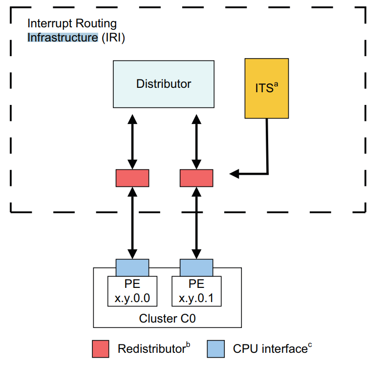

# GICV3(Generic Interrupt Controller - version 3)

## 关于GIC

GIC即中断控制器, 负责管理中断的接收, 屏蔽, 路由等相关任务, 并向系统程序员提供配置的接口.

GIC与异常模型协作完成中断的整个生命周期, GIC主要负责`中断源-产生IRQ/FIQ信号`这段路, 关于处理IRQ/FIQ则是由CPU内部的*异常模型*来完成.

## 对比 GICv2

* 支持更多的处理器, 用`affinity routing` 方案来做中断路由.
* 支持中断分组, 为了配合ARMv8的异常等级模型
* 新增中断类型: SGI, 软件生成中断
* 新增中断类型: SPI, Shared Peripheral Interrupts  
* 对于CPU interface的寄存器, 可直接使用系统寄存器接口(system register interface)来访问, 比memory-mapped的方式快.
* ITS, Interrupt Translation Service   暂不介绍
* LPI, Locality-specific Peripheral Interrupts . 暂不介绍

>  GICv3支持ARMv8-A或ARMv8-R系列处理器, 但没有必然的绑定关系. ARMv8-A也可以使用GICv2.

## 中断类型

### Locality-specific Peripheral Interrupt (LPI)  

LPIs are always [message-based interrupts](https://en.wikipedia.org/wiki/Message_Signaled_Interrupts) interrupts.   这里不做介绍.

### Private Peripheral Interrupt (PPI)  

PPI是路由到**单个CPU**的外设中断, 不同的CPU可以使用相同的中断号. 例如, 所有CPU都可以使用中断号16表示私有的定时器中断.

### Shared Peripheral Interrupt (SPI)  

SPI是可路由到**一组CPU**的外设中断, Distributor 负责SPI路由.

### Software Generated Interrupt (SGI)  

SGI是由某个CPU产生, 路由到系统中的一个或多个CPU, 通常用于处理器间通信.

## GICv3 的组件

GICv3架构由以下逻辑组件构成: 

- A Distributor  
- A Redistributor for each CPU
- A CPU interface for each  CPU
- Interrupt Translation Service components (ITS). 可选, 暂不介绍

The Distributor, Redistributor  一起组成了 *IRI(Interrupt Routing Infrastructure)*.

{width="10px"}

### Distributor

控制SPI和SGI的路由. 对于 SPI, 提供了一下接口:

* 启动/禁用 SPI
* 设置 SPI 的优先级
* 配置对于 SPI 的路由
* 设置 SPI 的触发方式
* 生成 message-based SPI
* 为每个 SPI 分组
* 控制 SPI 的 `pending and active` 状态

对于`Distributor`的大部分配置通过`GICD_CTLR`实现. 包括:

* 启用 Affinity routing
* 禁用安全性
* 中断分组的配置.

> 关于Distributor 寄存器都含有 `GICD_` 前缀, 通过 `memory-mapped` 方式访问. 

### Redistributor

* 启动/禁用 SGI 和 PPI
* 设置 SGI 和 PPI 的优先级
* 设置 SGI 和 PPI 的触发方式
* 为 SGI 和 PPI 分配组
* 控制 SGI 和 PPI 的 `pending` 状态和 `active` 状态
* 与之链接的 CPU 的电源管理.

> 关于Redistributor 寄存器都含有 `GICR_` 前缀, 通过 `memory-mapped` 方式访问.

### CPU interface

* Acknowledge 一个中断
* 执行 End Of Interrupt
* Deactivate 一个中断
* 设置 CPU 的优先级Mask
* 配置中断抢占

> 关于 CPU interface 寄存器是以 `ICC_` 为前缀, 还有 `ICV` for vitual interrupt, `ICH` for hypervisor configuration.

## 中断的状态转换

1. 生成中断. 中断可能来自外部信号, 或者软件生成(SGI)
2. Distribute.  IRI 负责中断的分组, 优先级屏蔽等. 将合适的中断发送到CPU Interface.
3. Deliver. CPU interface 将中断发送到连接的CPU.
4. Activate. CPU读取IAR寄存器, 即发送ACK. 该中断的状态转为active.
5. Priority drop. 处理程序结束之后, 写`ICC_EOIR`寄存器, end of interrupt
6. Deactivation. 写`ICC_DIR`寄存器清除中断的active标志位. 一般来说, end of interrupt 和 deactivation 可配置成同时发生.

> `ICC_CTLR_ELx.EOImode` 位控制是否 end of interrupt 同时导致 deactivation.
>
> :question: EOI 和 deactivated 分开进行暂时还不知道应用场景.

## 中断ID: INTID

INTID 是中断的标识符, 它的最大值是*实现定义*的.

INTID按照中断类型分类的, 对照表如下:

| INTID       | 中断类型  | Note                                        |
| ----------- | --------- | ------------------------------------------- |
| 0-15        | SGI       | 本地的, 不同CPU可使用同一中断号代表不同中断 |
| 16-31       | PPI       | 本地的                                      |
| 32-1019     | SPI       | 全局的                                      |
| 1020-1023   | 特殊中断  |                                             |
| 1056-1119   | 扩展的PPI | 本地的                                      |
| 4096 – 5119 | 扩展的SPI | 全局的                                      |

### 特殊中断号

> These INTIDs do not require an end of interrupt or deactivation.  

1020: 

1021:

1022:

1023: 读`ICC_IAR1_EL1` 返回该值表明当前的CPU上没有待处理的中断.

## 中断分组

为了配合 ARMv8 的异常模型和安全模型, GICv3 支持为每个中断配置不同的组. 不同组的中断只能路由到特定的异常等级和安全状态进行处理.

共包含三个分组: Gourp 0, Secure Group 1, Non-secure Group 1.

* Group 0的中断需要在EL3 处理.
* Secure Group1 的中断需要在 Secure EL1 或者 Secure EL2(如果启用了虚拟化)处理.
* Non-secure Group 1 的中断需要在 Non-secure EL2 or Non-secure EL1 if not using virtualization

同时, 中断位于哪个组也决定了其触发的是FIQ还是IRQ. 对于 AArch64 来说, 对应关系可见下表:

| 当前异常等级       | Group 0 的中断 | Secure Group 1 的中断 | Non-secure Group 1 |
| ------------------ | -------------- | --------------------- | ------------------ |
| Secure EL1/0/2     | FIQ            | IRQ                   | FIQ                |
| Non-secure EL1/0/2 | FIQ            | FIQ                   | IRQ                |
| EL3                | FIQ            | FIQ                   | FIQ                |

- Group 0 的中断, 需要在EL3处理, 其优先级较高, 所以均属于 FIQ

## 中断路由

- PPIs are routed directly from the source to the local Redistributor .

- SPIs are routed from the source through the Distributor to the target Redistributor and the associated CPU interface.

- SGIs are generated by software through the CPU interface and Redistributor. They are then routed through the Distributor to one or more target Redistributors and the associated CPU interfaces  

### What is Affinity Routing?

Affinity routing 是一种基于地址的标识多个CPU的方法, 用于中断的路由. Affinity value 由4个8bit字段组成, 结构是`aff3.aff2.aff1.aff0`.

由于 PPI 的中断源是直连 Redistributor 的, 所以仅 SPI 和 SGI 可以使用 Affinity routing. 

- 对于 SPI, 目标CPU的 affinity value 通过`GICD_IROUTER<n>` 设置.
- 对于 SGI, 在生成时即可同时配置, 详见 `ICC_SGI0R_EL1` 和 `ICC_SGI1R_EL1`.

> Aff3.Aff2.Aff1.Aff0 与 Aff3.Aff2.Aff2.TargetList
>
> 对于SPI, 目标的CPU只能是一个, 故`Aff0`表示该CPU的ID. 而SGI可以配置同时发给多个CPU, 所以`TargetList`是基于位操作的, 每个位表示一个CPU. 

## 编程指导

### 初始化

由于 *Distributor* 整个系统共享的, 所以必须在其他核启动之前, 由主核完成初始化. 然后当所有核都启动后, 各自完成各自 *Redistributor* 和 *CPU interface* 的初始化工作.