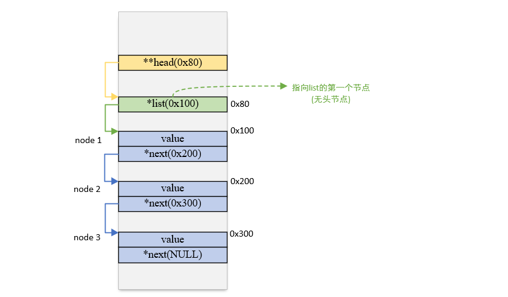

问题源于我在知乎刷到的一个回答: [能分享你C指针用得最灵活（飘）的一次吗?](https://www.zhihu.com/question/477832027/answer/2044206446)

文中提到了Linus关于**无头节点单项链表的删除操作**给出的一种新的思路, 我觉得对理解指针非常有帮助, 所以在这里详细描述一下这件事.

从我学习数据结构起, 对不含头节点的单向链表的删除操作, 做法常是: 借用**pre指针**搜索. 这种情况下避免不了对于链表中第一个节点的特判(第一个节点没有pre).

Linus提到了一种借助**二级指针避免该分支**的方法. 

```c
void remove_if(node ** head, remove_fn rm)
{
    for (node** curr = head; *curr; )
    {
        node * entry = *curr;
        if (rm(entry))
        {
            *curr = entry->next;
            free(entry);
        }
        else
            curr = &entry->next;
    }
}
```

指针的内容就是地址, `int *p = a` 也就意味着变量`p` 中保存着变量`a`的地址. 所以参数`head`在内存中的含义为:



假如要删除node2, 那么改变`*curr`实际上就是**改了node1的`next`成员**. 
