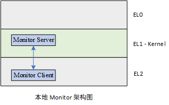
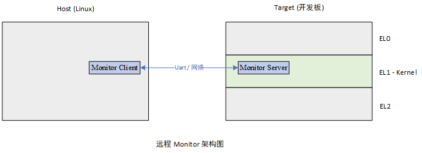

&nbsp;

## Kernel Monitor 是什么

Kernel Monitor 是一个适配我们微内核操作系统的 Kernel 调试和监控系统. 它能实现内核的动态调试和监控. 同时, 它还接管内核的同步异常和系统错误, 使开发者能够了解发生异常时系统的状态.

Kernel Monitor 具有一定的可扩展性, 例如通过统计内核中存储的 TCB 来实时监控系统中所有线程的状态. 可根据开发者的需求添加统计的对象, 如 Endpoint, Capability等.

&nbsp;

## Kernel Monitor 总体设计

Kernel Monitor 系统包含 Clinet 和 Server 两个部分. 简单来说, Client 负责处理用户输入, 并将输入进行解析, 封装为 一系列基础命令. 发送给 Server. Server 负责执行这些 基础的命令, 如设置断点, 查看某个地址的值等.

整个系统有*两种架构*: 本地 Monitor 和远程 Monitor. 

本地monitor 和远程 monitor 的区别是: **Monitor Client 的位置在哪, 是否与 Server 在同一个机器上**.

> 先说 Monitor Server, 它必须嵌入要调试的 Kernel 中, **位于一个地址空间**, 方便操作 Kernel 的内存.

### 本地 Monitor

在本地 Monitor 中,  client 和 sever 都位于目标机(Target)上, 目标机通常是开发板. 

对于 AArch64 体系结构来说, 最多有四个异常等级(EL0-EL3). <u>Client 可以运行在EL2.</u>

### 远程 Monitor

远程 Monitor 架构则不同, <u>Clinet 运行在宿主机(Host)上</u>, 通常是Linux. 它与 Server 的通信是通过网络/UART实现的. 

> Monitor Client 运行在本地和远程对于实现的难度和用户体验有影响. 
>
> * 如果 Client 实现在本地, 则 Client 无需实现网口和串口的驱动, 但Monitor 输入输出的串口与操作系统本身的串口相同, 信息冗杂在一起不易查看; 同时, 如果 Client 实现在本地, 那么对于ELF的解析需要在无操作系统提供的库支持下完成, 可能比较复杂.
>
> * 如果 Client 实现在远程, 即为 Linux 上的一个APP. 那么它和 Server 的通信就需要通过外部的网口或者串口(对于我们使用的64位开发板只引出了一个串口, 所以只能使用网口). 需要在 Server 上实现网口的驱动, 这部分比较复杂. 但是好处是 Client 的实现简单很多, 因为有 Linux APP 运行环境的支持. 同时, 远程 Monitor 架构下, Monitor 和 操作系统自身的输入输出分开, 用户可读性更好.

Server 是嵌入到Kernel的代码中, 与Client进行交互. 它是整个 Monitor 系统的后端, 负责实现基础的调试操作. 例如, 设置断点, 内存的读写, 寄存器的读写等. 

- 由于Server与 Kernel 位于同一个地址空间, 所以查看/修改内存的值是非常方便的. 对于寄存器也是同理.
- 断点(Breakpoint), 监视点(Watchpoint), 单步执行(Soft step)的实现依赖与 ARMv8 提供的的 [self-hosted debug](https://developer.arm.com/-/media/Arm%20Developer%20Community/PDF/Learn%20the%20Architecture/V8A%20Self-hosted%20debug.pdf?revision=5eff4cc6-b4ca-4017-a07d-2957307058cb) 支持.

同时, Server 还负责监视系统中所有的 同步异常和系统错误. 一旦发生, 可在 Monitor 中查看某些内存, 寄存器的值定位问题发生的原因.

###  Monitor Client 设计

Client 的构成可分为三个模块 : 

* 用户交互模块
* 符号处理模块
* 消息收发模块

用户交互模块负责处理用户的输入输出, 调用其他两个模块完成调试命令.

符号处理模块负责解析可执行文件(ELF), 并建立静态符号表, 存储符号和地址的对应关系.  将用户输入的符号解析为虚拟地址, 或者反向解析.

消息收发模块负责处理用户的输入, 将其转化为基础, 标准的命令, 发送给Server执行. Client 和 Server之间通信的数据包协议可以使用 [GDB Remote Serial Protocol](https://sourceware.org/gdb/onlinedocs/gdb/Remote-Protocol.html) (以下简称RSP协议), 或者自己规定一个协议也是可行的.

> RSP协议支持三种基础命令:
>
> 1. 寄存器相关 
> 2. 内存相关
> 3. 程序控制命令

### 启用 Monitor 时 Kernel 启动流程

1. Kernel 首先做必要的初始化, GIC, 异常向量表, MMU等.
2. 将控制权交给 Monitor, 等待用户输入.

&nbsp;

## Kernel debug 过程示例

### 示例一: 查看变量 `var` 的值

1. 用户输入 `print var` 指令. 
2. 由符号处理模块, 将`var`符号转为var 虚拟地址.
3. 由消息收发指令将请求封装为RSP协议包格式, 并发送到 Monitor Server.
4. 执行流程交给 Monitor Server, 它访问该地址, 将内容封装发回 Monitor Client.
5. Client 输出`var`的值, 继续等待用户输入

### 示例二: 添加断点到 `main` 函数

1. 用户输入 `break main` 指令
2. 由符号处理模块, 解析得到 `main` 函数的地址.
3. 消息收发模块将请求封装为RSP包格式, 发送到Monitor Server.
4. 执行流程交给 Server. 它执行 *breakpoint exception 指令*, 并设置相关软件断点相关寄存器
5. 执行流交给 Kernel, 直到达到断点处(可使用地址+ContextID双重验证), 触发Debug异常
6. Debug异常属于同步异常, 由 Monitor 系统接管, 回到 Client 继续等待用户输入

### 示例三: 单步执行

1. 用户输入 `step` 指令
2. 消息收发模块将请求封装为RSP包格式, 发送到 Monitor Server.
3. 执行流程交给 Server, 启用 software step. 然执行一次异常返回, 回到Kernel 继续执行.
4. 因为启用了 Software step, 回到 Kernel 执行完一条指令后, 就会触发 Debug异常
5. Debug 异常属于同步异常, 由 Monitor 系统接管, 回到 Client 继续等待用户输入

&nbsp;

## 其他拓展功能

back trace

性能分析
