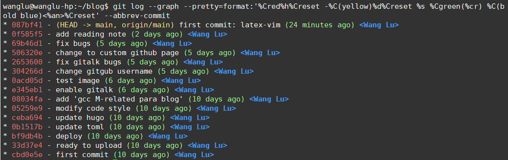

## 合并操作: git merge

merge 有两种方式:

- fast-forward
- three-way merger

### Fast-forward Merge

假设合并的双方为`main`为`dev`, 如果其中一个是另一个的祖先, 此时直接移动 HEAD 到前方即可, 称为 fast-forward.

例如, 当前在 main, 执行`git merge dev`的过程如下:

```
     main                              main
       |                                |
M1 --- M2          ===>    M1 --- M2 -- F1
       \                                |
        \--- F1                        dev
             |
           dev
```

### three-way Merge

合并的两者不构成直接的祖先-孩子关系, 产生了分叉. 此时进行合并就需要有个基准(参考), 对于两边相较于基准的每个 diff 来说:

- 合并的两者都在基准上进行了改动, 且改动不一致, **标记为冲突**
- 如果该 diff**仅在其中一方**有改动, 那么就保留此次改动

合并时使用的参考就是**两个合并 commit 的最近公共祖先**, 这种借助三个 commit(main, dev, 公共祖先)才能完成的合并操作就叫做 three-way merge.

例如, 当前在 main, 执行`git merge dev`的过程如下:

```
             main                                main
              |                                   |
M1 --- M2 --- M3    ===>     M1 --- M2 --- M3 --- M4
       \                            \            /
        \--- F1                      \--- F1 ---
              |                           |
             dev                         dev
```

> three-way 的合并方式如果发生了冲突, 会产生一次额外的 merge commit, 下面介绍它

### 什么情况下 merge commit 没有任何 diff?

按照上面的例子, three-way merge 发生冲突后会产生一次额外的 merge commit, 即 M4. 如果这是去查看 M4 相较前一次 commit 的 diff, 有时是没有的, 有时又会产生 diff.

如果在解决冲突的过程中, 我们仅仅是接收了 M2,M3 或者 F1 的修改, 那么此时 merge commit 就不会有 diff.

然而, 在解决冲突时, 我们也可以不采用来自两条路径的修改, 做一次新的修改(可以说, 同时接收两条 diff 就是这种情况), 此时查看 merge commit 的 diff 就是有内容的.

## 变基: rebase

rebase 命令需要指定一个**基准分支**，`git rebase <base-branch>`，
rebase 会将当前所处分支整体移动到`base-branch`之后，即改变了当前分支的历史。

```
// before rebase
[A]---[B]---[C]---[D]<-dev
  \
   \--[E]<-master

// after rebase
[A]---[E]---[B]---[C]---[D]<-dev
       |
       master
```

### 交互式 rebase

交互式 rebase 是一种更高级的用法。基础的 rebase 上面说了是将当前分支的所有提交移动到 base-branch 之后。而交互式 rebase 提供一个方法，在移动之前"挑选"当前分支的 commit。

实际工程中，通常来说，我们将开发分支移动到 master 之前，可以经过交互 rebase 来整理开发分支中混乱的 commit 记录。

具体的使用方法是，为`git rebase`指令提供`-i`参数:

```sh
git checkout dev
git rebase -i master
```

这个命令会打开一个文本编辑器，列出当前 feature 分支的所有提交:

```
pick 33d5b7a Message for commit #1
pick 9480b3d Message for commit #2
pick 5c67e61 Message for commit #3
```

列出的内容就能完整的表示 dev 分支的所有提交，按照顺序。而我们不仅可以任意的重排这些 commit，而且修改`pick`关键字就能对这些 commit 做改动。举个例子，我们可能发现 commit2 只是对于 commit1 做了一个很小的改动，它们完全可以合并为一个 commit，那么直接 commit2 的`pick`修改为`fixup`，整个内容变为:

```
pick 33d5b7a Message for commit #1
fixup 9480b3d Message for commit #2
pick 5c67e61 Message for commit #3
```

当你保存并退出这个文件时，改动就会生效，不仅将 dev 整体移动到了 master 后，并且合并了前两个 commit。

```
// after rebase interactive
[A]---[E]---[B]---[D]<-dev
       |
       master
```

### rebase 整理多个 commit

如上面交互式 rebase 所述，当你开发完 dev 分支，需要`merge`到 main 分支时，可以先利用交互式 rebase"整理"一下 dev 分支的 commit。

这里其实要用到一个小 trick，上面说过 rebase 命令需要指定一个 base-branch，实际上是一个 base-commit，这种场景下我们不是要合并其他分支，所以**base-branch**可以选择当前 dev 分支的前面某一次 commit。

```sh
git checkout dev
git rebase -i HEAD~3
```

以上指令实现的功能就是给你整理最后 3 次提交的机会，但**不会合并其他分支的东西**。

那如果我想整理整个 dev 分支呢？是向上找到 dev 的第一次 commit 吗？ Git 提供了一个方便找到 dev 分叉出来的那次 commit，将其输出传递给`git rebase -i`即可实现整理整个 dev 的所有 commit。

```sh
git merger-base dev main
```

## `git merege` vs `git rebase`

### 准则

- 如果分支已经被提交到远程仓库，就不能再改变他的历史了，即不能使用 rebase。
  git 也会阻止你这么做，因为分支的历史已经被修改，除非 force-push。

- 你能进行 rebase 的分支是本地的”私人分支”，私人表示为: 只有你自己在使用，别人不会基于你的分支做东西。

### dev 同步主分支的改动: rebase

假设我们正在本地的 dev 分支开发一个特性，此时你的同事在 main(也可以是其他的远程分支)上提交了一个重要的 commit，以至于你需要它来继续你的开发任务。

这种情况我们使用 rebase 和 merge 都能完成目标，但是 rebase 是更好的选择。

- 首先满足 rebase 的使用条件，我们仅仅是破坏了本地 dev 分支的历史，并没有动到其他的远程分支，所以就不存在干涉别人
- 其次，在 dev 上 merge 其他分支会产生一次不必要的*merge commit*，其不代表任何实际意义，没必要存在的

### 合并 dev 到主分支: merge

很简单的逻辑，主分支或者其他合作开发的分支并不是你一个人在用，并且需要最后同步到远程仓库，不符合使用 rebase 的准则

# git log

## 参数:

| Parameter                | Description                                                        |
| ------------------------ | ------------------------------------------------------------------ |
| non-param                | 列出所有历史提交的 SHA、作者、提交日期和 commit                    |
| -p                       | 按补丁显示每次更新，比--stat 更全                                  |
| --stat                   | 显示每次更新修改文件的名称及添加（删除）的行数。比--name-only 更全 |
| --name-only              | 显示文件清单                                                       |
| --name-status            | 显示文件清单及改动方式(新增、删除、修改)                           |
| --oneline                | 只显示前 6 位 SHA 值和 commit                                      |
| -n                       | 显示前 n 条 log                                                    |
| \<branch\>               | 查看某个分支的历史提交。**该参数只能 log 命令之后**                |
| \<branch1\>..\<branch2\> |                                                                    |
|                          |                                                                    |
|                          |                                                                    |

参考网站：https://www.cnblogs.com/bellkosmos/p/5923439.html

## Example 1: 彩色显示重要信息

```sh
git log --graph --pretty=format:'%Cred%h%Creset -%C(yellow)%d%Creset %s %Cgreen(%cr) %C(bold blue)<%an>%Creset' --abbrev-commit
```



## Example 2: 查看本地分支和对应远程分支的 commit 差异

```sh
git log --oneline main..origin/main
```

# 子模块: submodule

## 新增一个子模块
0. 将子模块上传到远端仓库上
1. 执行`git submodule add [url] [path]` 
2. 此时执行`git status` 会有两个changes，分别是：
   - `.gitmodules`: 记录子模块的path和url
   - `[子模块同名的文件]`: 记录主项目追踪的是子模块的哪个commit.
   >也就是说主项目中惠济路自己跟踪子模块的commit，并不一定总是最新的。

3. `git add`这两处改动，`git commit -m "add submodule xxx"`

## clone一个使用子模块的项目
1. 用常规的`git clone`命令将主项目拿下，此时子模块不会自动下载，只是一个空的目录
2. `git submodule init`，**这个命令其实是带参数的**，指定你想更新哪些子模块，
   缺省代表所有子模块。该命令实际的行为是将`.gitmodule`中的内容写入`.git/config`
3. `git submodule update`, 按照`.git/config`指定的子模块去下载，**注意下载的
   commit不一定是最新的，上面讲过**

>:question: `git submodule init`命令是否有意义？
>
> 有时我们并不想同步所有的子模块，而是其中的某几个，因为可能想自己重写一些，这时可以添加参数
> 指定想要同步的那些子模块。

>:two::three:可以合并为一条命令： `git submodule update --init`， 同步所有子模块。
   
## 修改更新子模块
如果仅仅是使用子模块，并不做修改，那不用关注这个。但如果你同时参与submodule的开发，那就需要注意。

1. 修改子模块并提交；这一步很常规，`cd`到子模块中，做完修改commit即可
2. 此时会发现在主项目中也多了一个额外的change，是刚才修改子模块的同名文件，
   查看diff会发现改动为commit id改为了刚才提交的那次子模块修改

Q1: 这次改动代表什么含义？

我们知道，子模块同名文件中记录主项目跟踪此子模块的commit，也是`git commit update` 会达到的
commit。含义是**主项目配合子模块的这个commit是ok的**。而这次改动也就代表跟踪的commit想要
发生变化，由于你刚才对子模块修改造成的，git自动猜测你想同时改动主项目的追踪。


Q2: 对这个改动应该做什么操作？

分两种场景: (1)如果子项目的这些更新有意义同步到主项目中，那么就add并commit这个同名文件的改动，
message为"更新submodule"。 (2)如若只是更新子项目而已，或许是为了其他依赖的项目所改的，并不
想涉及到本主项目，那么就restore此次更新，或者重新执行`submodule update`即可(前提是对子模块
的修改已经push)。

所以说，同意主项目中的这次change的人必须是更新这次子模块的人，由他决定是否同步到主项目。
其他人**甚至在使用期间都不需要`cd`进入子模块做`git pull`的**，这样也就不会有决策产生，即便
子项目在远端更新了，你要做的就是关注那个同名文件就行，当同名文件更新了，在主项目中 
`submodule update`即可，
## 子模块的优缺点
TODO